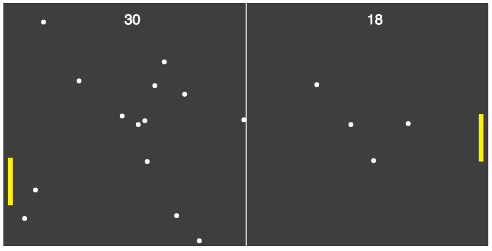

# Pong Game

A basic pong game using HTML5 Canvas. Initially based on this [blog post](http://blog.mailson.org/2013/02/simple-pong-game-using-html5-and-canvas/).

## Setup

Install dev environment (Webpack) dependencies

`> npm i`

Run Webpack

`> webpack --watch`

## Keys

##### Player 1:
* a: up
* z: down
* q: fire a new ball

##### Player 2:
* ▲ : up
* ▼: down
* /: fire a new ball
